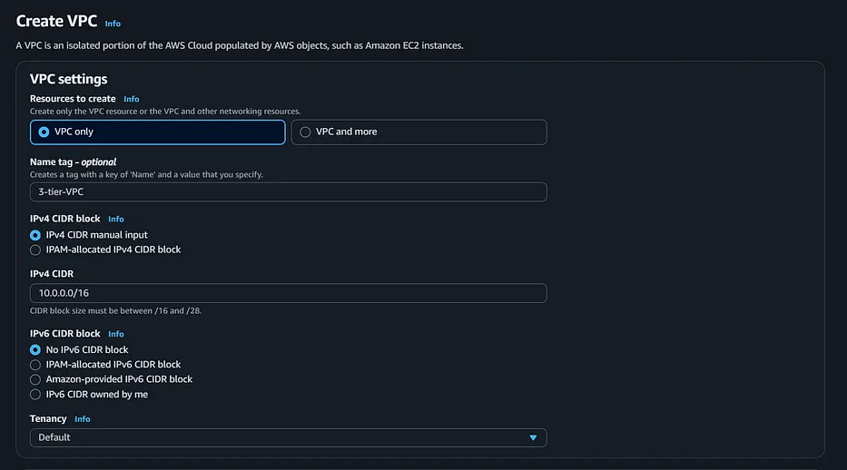
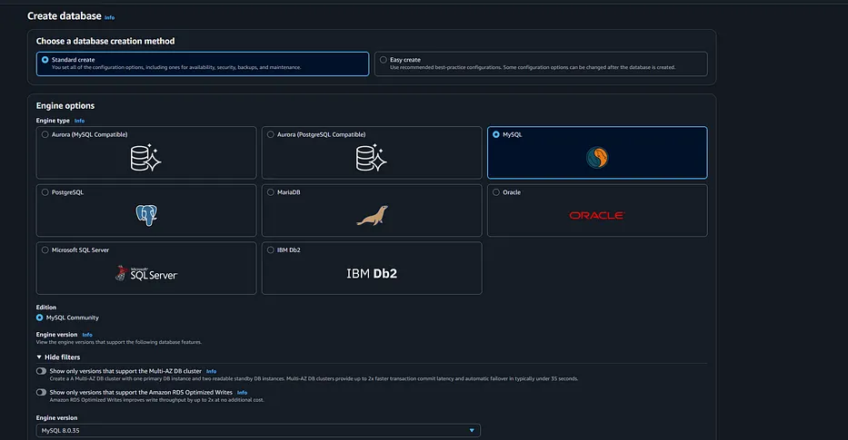

# 3Tier Artitecture with Load Balancers & AutoScaling

## Description: 
This workshop is a hands-on walk through of a three-tier web architecture in AWS. We will be manually creating the necessary network, security, app, and database components and configurations in order to run this architecture in an available and scalable manner.

## Artitecture Overview:


 In this architecture, a public-facing Application Load Balancer forwards client traffic to our web tier EC2 instances. The web tier is running Nginx webservers that are configured to serve a website and redirects our to the application tier's internal facing load balancer. The internal facing load balancer then forwards that traffic to the application tier, which is written in php. The application tier manipulates data in an RDS MySQL and returns it to our web tier. Load balancing, health checks and autoscaling groups are created at each layer to maintain the availability of this architecture.

### What is a 3 Tier Architecture
A 3 tier architecture consists of a __presentation tier__, __an application tier__, and __a data tier__. The presentation tier houses the user interface, such as the website that a user or client navigates to. It can also be thought of as the "front end." The application tier is where data is processed and is often called the "back end." The data tier is where data is stored and managed.

### Benefits of a 3 Tier Architecture
* __Decreased development time__ - different teams can work on different tiers simultaneously, resulting in decreased time to deploy
* __Increased scalability__ - a tier can have an auto-scaling group independent of other tiers, meaning for each tier, you only use what you need
* __Increased reliability__ - each tier can have multiple resources in multiple availability zones and the success and availability of one tier is independent of the other tiers
* __Increased security__ - each tier can have its own security group, allowing for custom permissions depending on the needs of that tier

## Let's Create 👉

 ## Step-1: Create VPC
 

 1. Click on Your VPC > Create VPC.

 2. Provide a name for the VPC , and also the IPv4 CIDR (10.0.0.0/16) . Then click on create VPC.

 ## Step-2: Create Subnets

Create 8 Subnets- 2 Public Subnet, 2 Private subnets for Webtier, 2 subnets for Apptier and 2 subnets for dbtier.

* PublicSubnetZoneA- 10.0.0.0/20
* PublicSubnetZoneB- 10.0.16.0/20
* WebSubnetZoneA-    10.0.32.0/20
* WebSubnetZoneB-    10.0.48.0/20
* AppSubnetZoneA-    10.0.64.0/20
* AppSubnetZoneB-    10.0.80.0/20
* DBSubnetZoneA-     10.0.96.0/20
* DBSubnetZoneB-     10.0.112.0/20

.png)

## Step 3- Create Route Tables

Create Two Route Tables - Public Route Table and Private Route Table

.png)

1. Then Create **Internet Gateway** and Attach to the VPC.

2. Add route of Internet Gateway in Public Route Table

## Step 4- Create RDS(Mysql) Database


Create Database and port number 3306 in Security Groupof RDS

### Steps to Create MySQL RDS:
1. Open RDS Console
   *  Go to AWS Console → Search for RDS → Click Create Database.

2. Choose Database Creation Method
   * Select Standard Create.

3. Select Engine
   * Choose MySQL as the database engine.
   * Select the MySQL version you need (latest recommended).

4. Templates
Choose a template.
   * Free Tier (for testing)

5. Settings
   * DB Instance Identifier: e.g., my-mysql-db
   * Master Username: e.g., admin
   * Password: Enter and confirm a strong password.

6. Instance & Storage
   * Choose an Instance class (e.g., db.t3.micro for free tier).
   * Allocate storage (default 20GB).

7. Connectivity
   * Choose your VPC.
   * Decide if the DB should be publicly accessible.
   * Attach a Security Group:
   * Allow inbound traffic on port 3306 (MySQL) from trusted IPs or EC2.

10. Create Database
    * Click Create Database.
    * Wait until status changes to avaliable

## Step 5- Launch Ec2 Instances

.png)  

1. Lauch JumpServer in public Subnet for ssh to RDS.
   * Install Mariadb
   * Create Database and Table
     ```
     sudo yum install mariadb-server105 -y
     sudo mysql -u admin -p
     ```

2. Lauch Appserver in Public Subnet
   * Install Nginx, php and php-mysql connector
   * Start and enable nginx and php-fpm
     ```
     sudo yum install nginx php -y
     sudo service nginx start
     sudo systemctl enable nginx
     sudo service php-fpm start
     sudo systemctl enable php-fpm

     sudo yum install mysql-php8.4.x86_64
     
     ```

 3. Launch WebServer in Public Subnet 
    * Install nginx and enable
      ```
       sudo yum install nginx -y
       sudo service nginx start
       sudo systemctl enable nginx
      ```

## Step 6 - Get AMI
Create AMI(Amazon Machine Image) of Webserver and Appserver for AutoSCaling

.png)

## Step 7 - Create Autoscaling
Create auto sacling for webtier and apptier.

1. Launch Template for Webtier and Apptier

2. Create Auto Scaling Group
   * Mimimum- 1
   * Maximum - 4
   * Desire - 1

.png)   

## Step 8- Create Load Balancer Target group

Create Target Groups for webtier and Apptier

.png)

## Step 9- Create Load Balancer
Create __Internet Facing Load Balncer__ for WebTier.

Create __Internal Load Balancer__ for AppTier

.png)

## Conclusion

A 3-tier architecture separates an application into three logical layers: web (presentation), app (business logic), and database (data storage). This structure enhances scalability, security, and maintenance by isolating each layer. It allows each tier to be managed, updated, and scaled independently. In cloud environments like AWS, it’s a best-practice model for building robust and modular applications.


